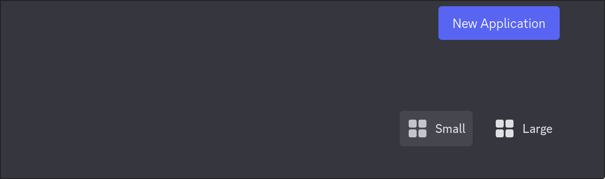
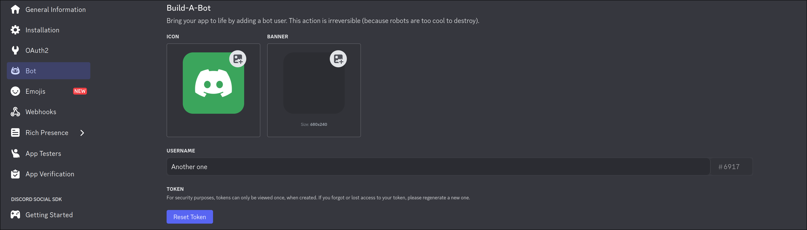
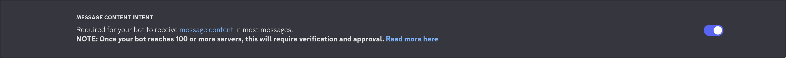
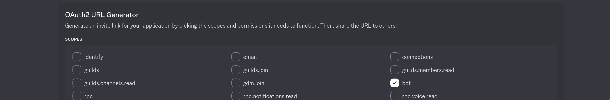

# discorss
Discorss is a simple command line application that mirrors your specified Discord channel to an RSS feed. Unlike many other apps, discorss doesn't only send RSS updates to Discord, but _the other way as well!_ Discorss can automatically replace roles, set up proper titles and other XML elements and download images.
## Setting Up
The repository includes a `sample_config.toml`, which contains all of the required information to run the program. The executable takes just **one** argument — the file path to the config file. *By default*, e.g. with zero arguments, it looks for `config.toml` in the directory, in which it is located. If it is not present, the program exits. Let's look at the sample config.
### Sample Config File
``` toml
[Discord]
token = ""
channel = 1111111111111111111
roles = ["@everyone"]
inline_roles = ["everyone"]
trim_roles = [true]
linking_time = 180

[RSS]
title = ""
description = ""
link = ""
default = "Announcement for "

rss_version = "2.0"
prefer_config = true

[Local]
media_folder = "media"
rss_feed_file = "feed.xml"
```
In the sample config, you will find quite a diverse selection of nodes. We will go through each element and focus on the less intuitive ones.
#### Discord
* `token` is your Discord bot token. How to get one is explained in the [next section](#obtaining-the-discord-token).
* `channel` is the ID of the channel you want to mirror. You can get it by right-clicking the channel in Discord, and selecting 'Copy Channel ID' at the bottom
* `roles` is a list of all of the roles you wish to manipulate. Except for `@everyone` and `@here`, for every role you must get its role ID. You can do that by right-clicking the role in somebody's profile. All roles must follow this format: `<@&numbers>`, where 'numbers' are replaced with the ID. Example: `<@&1111111111111111111>`
* `inline_roles` is how you would like to represent the role when in text. For example: `@everyone` will turn to `everyone` when inside of a text block. This is done, so that the flow of text is more natural
* `trim_roles` is a list of booleans, stating whether you want the role to be trimmed off the beginning of a message, if it is found there
* `linking_time` is the time in __seconds__, for which if the message is sent within that timespan from another, it will be added onto the end of the previous one. Or, to put it simply, if a second message is sent within that timeframe after the first, they become one
#### RSS
* `title` the title of your feed
* `description` the description of your feed
* `link` the link to the **folder** in which your feed file is located. This is specifically **the folder**, so that any downloaded files have a proper destination and as a result, URL. This is the **website** link, e.g. `https://example.com/rss/`
* `default` is the string that will be followed by the date and time in UTC and used as an RSS item's title, if one cannot be extracted from the message
* `rss_version` is self explanatory. This *will not* change how the file is structured, so you probably shouldn't change it
* `prefer_config` is a boolean. If your config and your feed's title, link and description don't match, one is chosen based on this parameter
#### Local
* `media_folder` is the path to the folder, where all of your media is downloaded, which is mainly images
* `rss_feed_file` is the most important (along with `token`) one: it is the file path to your RSS feed
**Important:** every single filed in the config *must be filled out*, otherwise something will probably misfunction. **Also**, for the roles parameters: each one must match the one above/below it, as there is no way to mark which one corresponds to which otherwise.
### Obtaining the Discord Token
Before you can even think of getting a token, you first need to make sure you have a Discord account. If you do, that's great and we can proceed. Go to [the Discord applications portal](https://discord.com/developers/applications/), and click the big purple "New Application" button.



Then give it some creative name, set up its avatar image, etc. Then, after you are done, go into the 'Bot' section, where you will find a "Reset Token" button.



Once you obtain your token, put it into the config and/or put it in a safe place, because who knows what someone evil will do with your innocent little announcement bot. **However**, this is not it yet. The next thing you must do is scroll down and check the 'Message Content Intent', because if you don't, your bot <ins>won't be able to read messages</ins>.



Now you want to add your bot to your server. Please go into the 'OAuth2' tab, where you will find the URL generator. There, select "bot", because you are adding a bot. A new window full of checkboxes will appear below. There in 'Text Permissions' select "Send Messages" and "Read Message History". You do want your bot to send you RSS feed updates, right?



Finally, click 'Copy' next to the generated link and paste it into your web browser. If will open Discord and prompt you about which server to add your bot to. You can figure the rest yourself.
### RSS Feed
If you don't have an existing RSS feed, you don't need to worry. The program will generate one if it isn't present, yet you still **must include a file path** to where is is supposed to be in your config. Make sure that your feed is accessible through a URL, e.g. it is on the internet, and test it out with an RSS reader. I would recommend running this program on the same server, that you are hosting your feed, to reduce any possible latency and ensure that the updates are intact.
## Running the Program
You have two options when it comes to running the program:
1. Use the framework independant binary, that is provided in the 'Releases' section; or
2. Clone the repository and use `dotnet run` from the terminal when in the project folder
For the second option, and in order to build the app, you will need to have **.NET 9 SDK** installed on your system, which you can find at [Microsoft's website](https://dotnet.microsoft.com/en-us/download).
``` bash
git clone https://github.com/lucacelee/discorss.git
cd discorss
dotnet run
```
## Building from source
To build the app, you need, as I mentioned in the previous section, the **.NET 9 SDK** installed on your system, which you can find at [Microsoft's website](https://dotnet.microsoft.com/en-us/download). Once you have ensured you have that by either installing, or using `dotnet --version` in your terminal.
To begin with, clone the repository with Git, then `cd` into it and run `dotnet publish` to create a framework-dependant binary, or `dotnet publish --self-contained` to create a binary, that can be used without .NET installed on one's system.
``` bash
git clone https://github.com/lucacelee/discorss.git
cd discorss
dotnet publish --self-cointained
```
# License
This project is licensed under the [GPL v3](LICENSE).